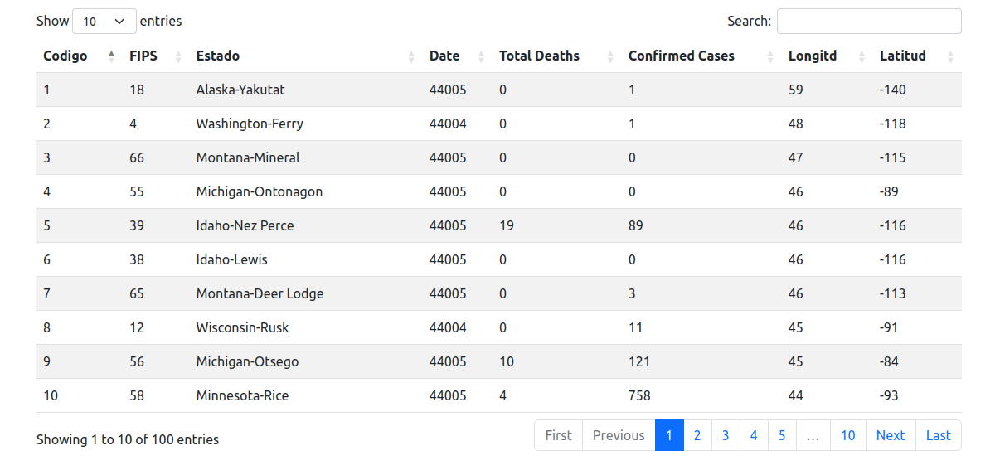

### BD2 - Grupo 4

**_Integrantes:_**

- Salazar Alva, Rodrigo Gabriel
- Sara Junco, Juan Sebastian
- Ponce Contreras, Luis Eduardo
- Lapa Carhuamaca, Arleth Ivhy

---

# Proyecto 1 | Organización de Archivos

## Introducción

La organización de archivos facilita la búsqueda y localización de los datos, para ello se emplean los distintos medios de almacenamiento secundario y manejo de los fundamentos de archivos. El objetivo del proyecto es la implementación y análisis de los algoritmos de almacenamiento _Seguential_ _File_ y _Extendible_ _Hashing_, los cuales son técnicas de organización de archivos en memoria secundaria y acceso concurrente para lograr una buena gestión y eficacia, asimismo mostrar los resultados en una interfaz gráfica de usuario (GUI).

En primer lugar, se brinda una breve descripción de las dos técnicas de indexación de archivos en memoria secundaria, las cuales son: _Seguential_ _File_ y _Extendible_ _Hashing_, y de cada proceso de sus respectivas operaciones principales, tales como, inserción, eliminación y búsqueda. En segundo lugar, el dominio de datos a usar es de un dataset público llamado _Kaggle_, contiene un archivo plano con datos reales de una lista de casos de covid por region y fecha. En tercer lugar, se realizaron pruebas con la implementación de estas dos técnicas y una comparación, discusión y análisis de estos resultados experimentales obtenidos. En último lugar, se muestran las funcionalidades de este programa en un video.

## Técnicas Utilizadas

### Sequential File

Es una técnica simple en el sistema de administración de bases de datos, en esta técnica almacena los datos en forma de secuencial, es decir, se organizan uno tras otro en formato binario. Tiene dos implementaciones, una de ellas es _Pile File_ y la otra es _Sorted File_. También admite operaciones de datos, tales como: insertar, actualizar, eliminar y recuperar datos. Esto lo logra porque almacena los atributos de datos únicos y realiza la secuenciación lógica de los datos en la memoria de la computadora. En el presente proyecto se implementó el _Sequential File_ aplicando el método de archivo ordenado, asimismo, se realizó las siguientes operaciones:

#### Búsqueda específica:

Con esta operación se retorna los registros que coincidan con la _key_. El proceso para lograr este resultado es la siguiente:

 - Se realiza una condicional si el registro existe o no, en caso si exista, se continúa con la función.
   
 - La busqueda especifica utiliza busqueda binaria en nuestro archivo ordenado, implementada con el nombre de _searchfileordenado()_ lo cual devuelve un objeto. Verificamos que coincida con la _key_ cual indica la posición del objeto con dicha key a encontrar.
    
-   Búsqueda específica exitosa en el _dataset_
    
    -   Al insertar la _key_ de búsqueda y realizar la lógica de dividir por la mitad y buscar. Si devuelve un objeto _Record_ es porque el objeto se encuentra en el _dataset_ y la búsqueda ha sido exitosa, este objeto contiene los campos del registro.
 
-   En caso nos devuelve objeto vacio:
    
    -   Significa que el elemento no se encuentra en el _dataset_ o que la búsqueda se encuentra fuera de alcance. 
    
> La búsqueda específica realiza una cantidad de accesos a memoria secundaria de O(log(n)), donde n la cantidad de elementos en _datatset_.

#### Búsqueda por rango:

Con esta operación se retorna todos los registros que coincidan con dos _key_ de búsqueda. El proceso para lograr este resultado es la siguiente.

-   La función de Búsqueda por Rango utiliza la función de búsqueda binaria nuevamente, con ello localiza el begin-key o elementos mayores a él y menores a end-key.
-  Luego de encontrar las _keys_, se recorre linealmente los punteros hasta encontrar un elemento mayor o igual end-key. 
- Si el registro está entre los _keys_ se añade el registro al vector de _Record_ y se retorna dicho vector.

> La busqueda por rango realiza una cantidad de accesos a memoria secundaria de O(log(n) + k), donde n la cantidad de elementos en el _dataset_ y k la cantidad la cantidad de registros entre el begin-key y el end-key.

#### Inserción:

Con esta operación se inserta un nuevo registro, para ello seguimos los lineamientos de la técnica de _Sorted File_. El proceso para lograr este resultado es el siguiente:

-   La función de inserción utiliza la búsqueda binaria para obtener la posición de donde insertar y luego hace un intercambio de los punteros.
    
-   Casos:
    
    -   En el mejor de los casos se inserta en la última posición en el cual el costo de solo la inserción sin contar la búsqueda seria de O(1).
    
    -   Primero se verifica si el registro a insertar ya existe y si no, creamos un nuevo registro con el input ingresado. Para ello se realizó funciones según el caso que se presente, tales como, _insertarinicio()_, _insertarfinal()_, _insertbasico()_ y _inseratregistrosdesordenados()_.
        
    -  Segundo debemos ubicarnos en la posición actual del registro para insertar, obtener el siguiente registro a este, la posición del registro previo y del registro siguiente. 
    - Tercero se insertan los punteros actualizados, dado que hubo un intercambio durante la inserción.
    
> La Inserción realiza una cantidad de accesos a memoria secundaria de O(log(n)+k) por la búsqueda de un elemento menor al que se va a insertar y O(2) al sobrescribir los punteros que se intercambian para la inserción.

#### Eliminación:

Con esta operación se elimina un registro, asimismo, al borrar cierta cantidad de registros se debe reconstruir el archivo. El proceso para lograr este resultado es el siguiente:
    
-   Casos:
    
    -   Si el _dataset_ y el _aux dataset_ están vacíos, no procede.
        
    -   Primero se verificó que la _key_ existe en el _dataset_, luego obtenemos la posición lógica anterior y posterior a dicho registro. 
        
    -   Si este no cuenta con un elemento anterior al anterior de la key implementamos la búsqueda de nuevo pero para el objeto anterior al que queremos eliminar para así obtener su posición.
    -   Si tenemos el registro anterior al elemento al que queremos eliminar usamos su siguiente registro para identificar la posición del elemento queremos sobrescribir con los punteros del registro que queremos eliminar.

### Extendible Hashing

Es una técnica de hash dinámico, el _hashing_ en un sistema de gestión de base de datos el tiene el procedimiento que de ubicar racionalmente la posición de los datos requeridos, para ello crea nuevos índices o usar las estructuras de índice existentes mediante el uso de métodos dedicados llamados _funciones hash_ para buscar los datos específicos de la memoria del disco. La técnica del _Extensible Hashing_ proporciona una estructura dinámica que crece y se reduce a medida que la base de datos crece y se reduce. Se realizó las siguientes operaciones:

#### Búsqueda específica:

Con esta operación se retorna los registros que coincidan con la _key_. El proceso para lograr este resultado es la siguiente.

> Se calcula la posicion del bucket inicial en base a la clave única. Se recorre los registros del bucket y sus overflow pages en busqueda de los registros que coincidan con la _key_ solicitada, agregandolos a una vector. Finalmente, se retorna el vector de resultados

#### Búsqueda por rango:

Con esta operación se retorna todos los registros que coincidan con dos _key_ de búsqueda. El proceso para lograr este resultado es la siguiente.

> Se recorren todos los registros del indice, devolviendo las posiciones de los buckets inciales. Se recorre cada uno de estos buckets y sus overflow pages en busqueda de los registros que cumplan con la desigualdad definida por la _start-key_ y la _end-key_ .

#### Inserción:

Con esta operación se inserta un nuevo registro, para ello seguimos los lineamientos de la técnica de _Sorted File_. El proceso para lograr este resultado es el siguiente:

> Se localiza el bucket respectivo. Si este tiene profunidad local maxima, se recorre el bucket y sus overflow pages en busqueda de un espacio libre donde insertar. De no encontrar dicho espacio, se crea y encadena una nueva overflow page y se inserta sobre esta nueva page. Caso contrario, si el bucket no tiene profunidad local maxima, se evalua si este aun tiene espacio, de ser el caso, se inserta al final del bucket. Si el bucket estaba lleno, este se divide y se hace una llamada recursiva al insert.

#### Eliminación:

Con esta operación se elimina un registro. El proceso para lograr este resultado es el siguiente:

> Se calcula la posicion del bucket inicial en base a la clave única. Se recorre el bucket inicial y todos sus overflow pages en busqueda de registros cuya llave coincida con la _key_ proveida: de ser el caso, se eliminan.

### Cantidad de accesos a memoria secundaria:

|             | _SEQUENTIAL FILE_ | _EXTENDIBLE HASHING_ |
| ----------- | ----------------- | -------------------- |
| INSERCIÓN   | _O(n)_            | _O(1+k)_             |
| BÚSQUEDA (EXACTA) | _O(log N)_        | _O(1+k)_               |
| BÚSQUEDA (RANGO)  | _O(log N + L)_        | _O(n)_               |
| ELIMINACIÓN | _O(n)_            | _O(1+k)_             |

Donde n = numero de registros, k = numero de overflow pages y L=numero de registros dentro del rango
NOTE: Tabla de complejidad de los peores casos

## Resultados Experimentales

Se realizó las pruebas de las dos técnicas implementados donde se uso dos _datasets_, el primero es de data generada por un _script_ de datos de alumnos, cada registro contiene los siguientes campos:

- código
- sexo
- nombre
- apellido
- edad
- carrera
- ciclo

Mientras que el segundo, es con data real extraída de [kaggle](https://www.kaggle.com/datasets/yasirabdaali/corona-virus-covid19-us-counties), sobre _Covid-19 en los Condados de EE.UU._, donde cada registro contiene 8 campos, estos son:

- código
- fips code
- estado
- fecha
- total número de muertes
- total de casos confirmados
- longitud
- latitud

El análisis comparativo de las pruebas realizadas consta del tiempo de ejecución de cada técnica de indexación con diferentes cantidades de datos, las cuales son: 100,1 000,10 000 y 100 000. Por ello, se realizó múltiples pruebas, las cuales se acumularon y después se generó las gráficas correspondientes a cada operación.

#### Ejecutar Pruebas (Linux)

1. Descomentar la siguiente flag en Hash/ExtensibleHash.cpp y SequentialFile/main.cpp
```cpp
#define TEST_TIMECHRONO
```

2. Recompilar los binarios
```sh
$: make build
```

3. Ejecutar pruebas
```sh
$: ./generate_time.py
```

4. Obtener resultados
```sh
$: ./add_files.py
```

#### Gráfico Comparativo Inserción

Sintaxis de la función _insert()_ en _Sequential File_:

```sh
void add(Record record)
```

Sintaxis de la función _insert()_ en _Extensible Hashing_:

```sh
bool add(Record record)
```


Como se puede observar en la grafica el ExtendibleHash supera en performance al SequentialFile en todos los casos. Este es un resultado esperado y que respalda a la teoria dado a que, como se explico previamente, las complejidades de acceso a memoria secundaria (las acciones mas cara en el algoritmo) son O(1+k) y O(n). Note que k en el mejor de los casos es 0 y en el pero k=n/B donde B es el numero de registros por bloque. Sin embargo, en el caso promedio, y sabiendo que se esta usando una funcion de hashing cuya distribucion se espera sea uniforme, entonces el valor esperado de k es k= K_MAX / (2^DEPTH_MAX). Por lo tanto, se puede claramente ver que O(1+k) < O(n) en el caso promedio, explicando asi los resultados de la grafica.

Sin embargo, note que los graficos mostrados no son lineales como sugieren las complejidades O(n) y O(k+1). Esto se debe a que el resultado mostrado no es el resultado de una unica inserción, sino que el tiempo total requerido para hacer n inserciones inciando desde un archivo vacio. Note entonces que la secuencia de los valores de n para cada insercion es 1 + 2 + 3 + ... n lo que nos da un valor acotado por n^2. Es de esta forma que se espera que el grafico realmente refleje O^2. Adicionalmente, el eje x se encuentra en una escala logaritmica.

#### Gráfico Comparativo Búsqueda Exacta

Sintaxis de la función _search()_ en _Sequential File_:

```sh
Record search(int key)
```

Sintaxis de la función _search()_ en _Extensible Hashing_:

```sh
vector<Record> search(T key)
```


Los resultados experimentales reflejados en la grafica nos dicen que el ExtendibleHash tiene una mejor performance que el SequentialFile en todos los casos. Este es un resultado interesante dado a que las complejidades son O(1+k) y O(log n) respectivamente, pero como se explico en la seccion previa, el valor de k para el caso promedio se puede acotar en terminos lineales de n, lo que sugiere que, dado un n lo suficientemente grande, el SequentialFile deberia ganar. No obstante, lo que no se esta tomando en consideracion es que los overflow buckets unicamente se llenan cuando el resto de buckets no tienen espacio y, considerando que se tiene una profunidad de 32 y un bucket size de 1024, teoricamente seriaposible insertar incluso mas de 100k datos sin nunca tener que requerir de los overflow buckets, haciendo que la complejidad del ExtensibleHash sea para fines practicos O(1). Es de esta forma que el resultado obtenido cobra sentido siendo O(1) < O(log n).

#### Gráfico Comparativo Búsqueda Por Rangos
Sintaxis de la función _rangesearch()_ en _Sequential File_:

```sh
vector<Record> range_search(int key1, int key2)
```

Sintaxis de la función _rangesearch()_ en _Extensible Hashing_:

```sh
vector<Record> range_search(T begin_key, T end_key)
```


Los resultados experimentales del rangeSearch son los mas sorprendtes. Por la teoria se espera que el Sequential file supere en eficiencia al ExtendibleHash. Sin embargo, es importante consdierar dos factores:
1. La complejidad del algoritmo en el Sequential File depende no solo de la rapidez de acceso al primer registro, sino que tambien el numero de registros dentro del rango (L). A medida que este valor se acerca a n, la complejidad del algoritmo se convierte en O(log n + L) = O(log n + n) = O(n), siendo asi igual al ExtensibleHash 
2. El ExtensibleHash carga registros en bloques grandes y adyacentes, mientras que el sequential file extrae de uno en uno y de diferentes secciones del archivo (especialmente para la busqueda). Esta diferencia le otorga una leve ventaja al ExtensibleHash dado que puede extraer mas registros en una sola operacion y aprovecha mejor la cache por el acceso de espacio de memoria contiguos

Se hipotetiza que, dado un rango lo suficientemente corto y una cantidad de registros lo suficientemente grande el SequentialFile tendria mejor performance.

#### Gráfico Comparativo Eliminación

Sintaxis de la función _delete()_ en _Sequential File_:

```sh
bool delete(int key)
```

Sintaxis de la función _delete()_ en _Sequential File_:

```sh
bool remove(T key)
```


Los resultados experimentales del delete muestran que el ExtendibleHash tiene una perfomance significativamente que el SequentialFile para esta operacion en todos los casos. Este se debe a que el delete, si bien en el mejor de los casos tiene una complejidad de O(1), en el peor de los casos esta es una operacion extremadamente costos al tener que reconstruir el archivo, constando dicho rebuild O(n) accesos a memoria. De esta forma, este resultado respalda la teoria que nos indica O(n) vs O(k+1), siendo el ExtensibleHash el claro ganador.


## Pruebas de uso y Presentación

#### Ejecutar (Linux)

1. Comentar la siguiente flag en Hash/ExtensibleHash.cpp y SequentialFile/main.cpp
```cpp
// #define TEST_TIMECHRONO
```

2. Inicializar binarios con data de ejemplo
```sh
$: make start
```

3. Instalar requerimientos de python3
```sh
$: pip install -r requirements.txt
```

4. Ejecutar app
```sh
$: python3 app.py
```

#### Interfaz Gráfica

>Se implementó la siguiente interfaz gráfica de usuario, en primer lugar se debe seleccionar que tipo de técnica de indexación se ejecutará:


>Luego debe insertar la query a consultar en la base de datos:


Ejemplos de Queries Validas:
- select * from table;
- select * from table where id between 2 and 10;
- select * from table where id=10;
- delete from table where id=20; 
- insert into table values (989,46083,South Dakota-Lincoln,21/06/2020,1,323,43.27841182,-96.7203905);

>Y al finalizar, la interfaz le muestra de manera amigable el resultado de su consulta:



Con esto se logro el objetivo de presentar la aplicación de estas técnicas en una interfaz gráfica amigable e intuitiva.

#### Funcionalidad del Aplicativo

La presentación final en video se encuentra en el siguiente [link](https://drive.google.com/drive/folders/1I63Wk39D_wXSpe6upwzbRgq1xiqyiPRo?usp=sharing).
