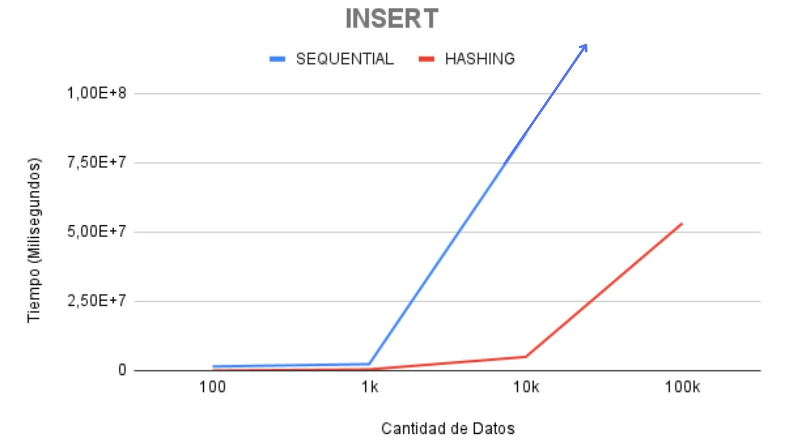
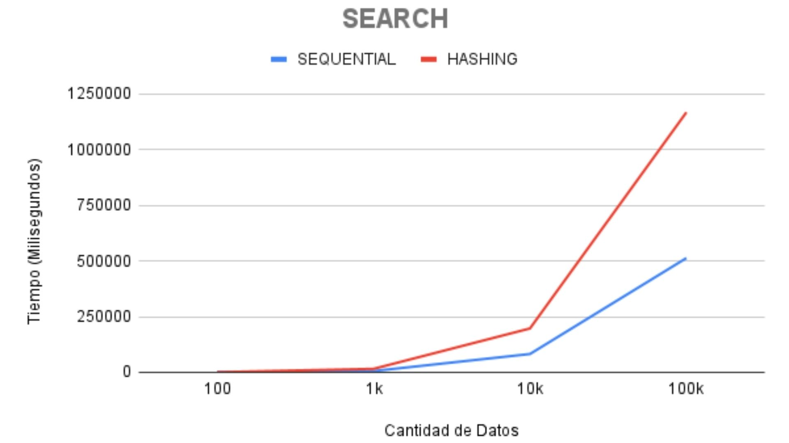
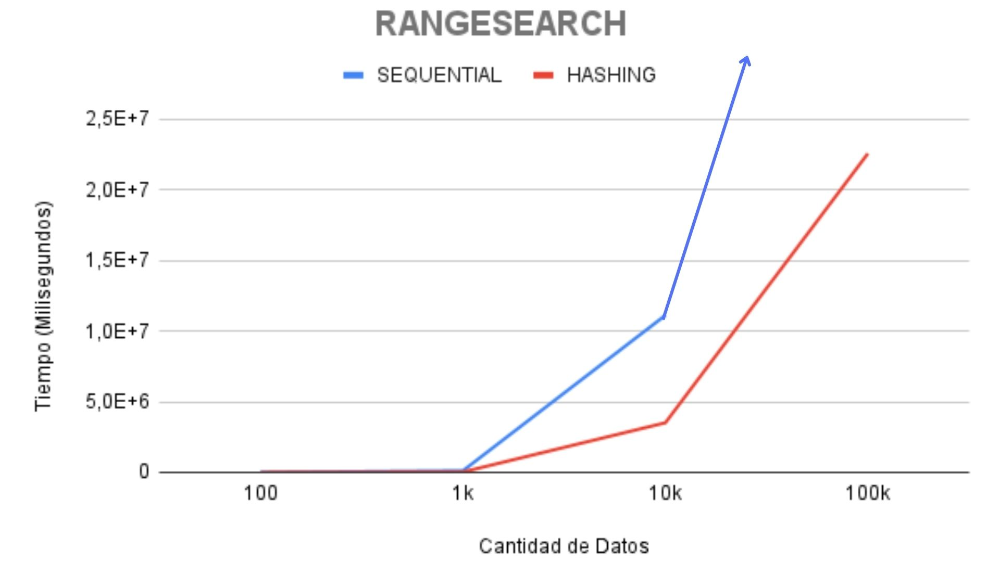
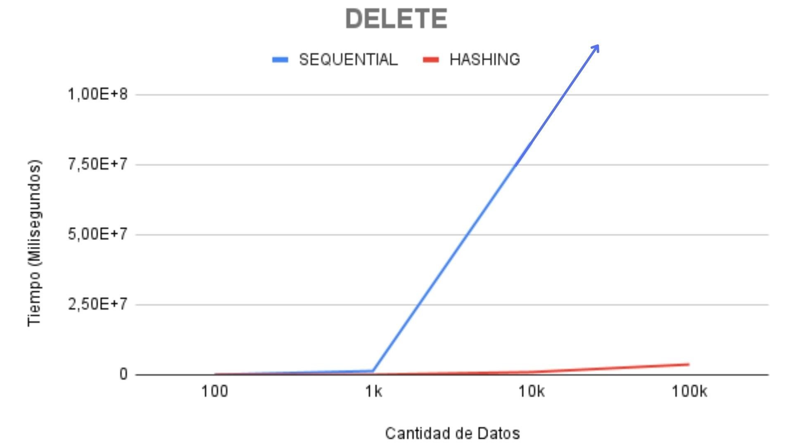
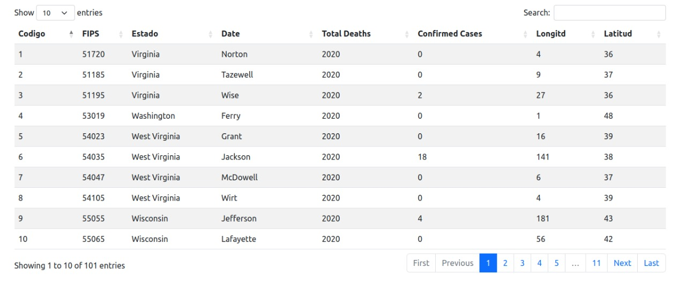

### BD2 - Grupo 4

**_Integrantes:_**

- Salazar Alva, Rodrigo Gabriel
- Sara Junco, Juan Sebastian
- Ponce Contreras, Luis Eduardo
- Lapa Carhuamaca, Arleth Ivhy

---

# Proyecto 1 | Organización de Archivos

## Introducción

La organización de archivos facilita la búsqueda y localización de los datos, para ello se emplean los distintos medios de almacenamiento secundario y manejo de los fundamentos de archivos. El objetivo del proyecto es la implementación y análisis de los algoritmos de almacenamiento _Seguential_ _File_ y _Extendible_ _Hashing_, los cuales son técnicas de organización de archivos en memoria secundaria y acceso concurrente para lograr una buena gestión y eficacia, asimismo mostrar los resultados en una interfaz gráfica de usuario (GUI).

En primer lugar, se brinda una breve descripción de las dos técnicas de indexación de archivos en memoria secundaria, las cuales son: _Seguential_ _File_ y _Extendible_ _Hashing_, y de cada proceso de sus respectivas operaciones principales, tales como, inserción, eliminación y búsqueda. En segundo lugar, el dominio de datos a usar es de un dataset público llamado _Kaggle_, contiene un archivo plano con datos reales de una lista de casos de covid por region y fecha. En tercer lugar, se realizaron pruebas con la implementación de estas dos técnicas y una comparación, discusión y análisis de estos resultados experimentales obtenidos. En último lugar, se muestran las funcionalidades de este programa en un video.

## Técnicas Utilizadas

### Sequential File

Es una técnica simple en el sistema de administración de bases de datos, en esta técnica almacena los datos en forma de secuencial, es decir, se organizan uno tras otro en formato binario. Tiene dos implementaciones, una de ellas es _Pile File_ y la otra es _Sorted File_. También admite operaciones de datos, tales como: insertar, actualizar, eliminar y recuperar datos. Esto lo logra porque almacena los atributos de datos únicos y realiza la secuenciación lógica de los datos en la memoria de la computadora. En el presente proyecto se implementó el _Sequential File_ aplicando el método de archivo ordenado, asimismo, se realizó las siguientes operaciones:

#### Búsqueda específica:

Con esta operación se retorna los registros que coincidan con la _key_. El proceso para lograr este resultado es la siguiente.

> Se implementó una búsqueda binaria, luego se ejecutó con la _key_ ingresada y al localizar el registro, esta función retorna la posición donde se encuentra dicho registro.

#### Búsqueda por rango:

Con esta operación se retorna todos los registros que coincidan con dos _key_ de búsqueda. El proceso para lograr este resultado es la siguiente.

> Se realiza la búsqueda binaria y en este caso, se retorna todo los registros entre los dos parámetros de la función y se leen secuencialmente.

#### Inserción:

Con esta operación se inserta un nuevo registro, para ello seguimos los lineamientos de la técnica de _Sorted File_. El proceso para lograr este resultado es el siguiente:

> Se recibe a un archivo como input, los archivos se encuentran ordenados físicamente, por ello se realiza un auxiliar para insertar el nuevo registro y luego se actualiza, con ello se asegura que nuestro archivo se encuentre ordenado.

#### Eliminación:

Con esta operación se elimina un registro, asimismo, al borrar cierta cantidad de registros se debe reconstruir el archivo. El proceso para lograr este resultado es el siguiente:

> Primero se realiza la búsqueda del key localizando el registro a eliminar, con la función seekg(pos) obtenemos la posición, con esta posición aplicamos la técnica LIFO, donde en el header escribimos el nuevo next delete y modificamos el next delete a eliminar.

### Extendible Hashing

Es una técnica de hash dinámico, el _hashing_ en un sistema de gestión de base de datos el tiene el procedimiento que de ubicar racionalmente la posición de los datos requeridos, para ello crea nuevos índices o usar las estructuras de índice existentes mediante el uso de métodos dedicados llamados _funciones hash_ para buscar los datos específicos de la memoria del disco. La técnica del _Extensible Hashing_ proporciona una estructura dinámica que crece y se reduce a medida que la base de datos crece y se reduce. Se realizó las siguientes operaciones:

#### Búsqueda específica:

Con esta operación se retorna los registros que coincidan con la _key_. El proceso para lograr este resultado es la siguiente.

> Se calcula la posicion del bucket inicial en base a la clave única. Se recorre los registros del bucket y sus overflow pages en busqueda de los registros que coincidan con la _key_ solicitada, agregandolos a una vector. Finalmente, se retorna el vector de resultados

#### Búsqueda por rango:

Con esta operación se retorna todos los registros que coincidan con dos _key_ de búsqueda. El proceso para lograr este resultado es la siguiente.

> Se recorren todos los registros del indice, devolviendo las posiciones de los buckets inciales. Se recorre cada uno de estos buckets y sus overflow pages en busqueda de los registros que cumplan con la desigualdad definida por la _start-key_ y la _end-key_ .

#### Inserción:

Con esta operación se inserta un nuevo registro, para ello seguimos los lineamientos de la técnica de _Sorted File_. El proceso para lograr este resultado es el siguiente:

> Se localiza el bucket respectivo. Si este tiene profunidad local maxima, se recorre el bucket y sus overflow pages en busqueda de un espacio libre donde insertar. De no encontrar dicho espacio, se crea y encadena una nueva overflow page y se inserta sobre esta nueva page. Caso contrario, si el bucket no tiene profunidad local maxima, se evalua si este aun tiene espacio, de ser el caso, se inserta al final del bucket. Si el bucket estaba lleno, este se divide y se hace una llamada recursiva al insert.

#### Eliminación:

Con esta operación se elimina un registro. El proceso para lograr este resultado es el siguiente:

> Se calcula la posicion del bucket inicial en base a la clave única. Se recorre el bucket inicial y todos sus overflow pages en busqueda de registros cuya llave coincida con la _key_ proveida: de ser el caso, se eliminan.

### Cantidad de accesos a memoria secundaria:

|             | _SEQUENTIAL FILE_ | _EXTENDIBLE HASHING_ |
| ----------- | ----------------- | -------------------- |
| INSERCIÓN   | _O(n)_            | _O(1+k)_               |
| BÚSQUEDA    | _O(log N)_        | _O(n)_               |
| ELIMINACIÓN | _O(n)_            | _O(1+k)_               |

NOTE: Donde n = numero de registros y k = numero de overflow pages

## Resultados Experimentales

Se realizó las pruebas de las dos técnicas implementados donde se uso dos _datasets_, el primero es de data generada por un _script_ de datos de alumnos, cada registro contiene los siguientes campos:

- código
- sexo
- nombre
- apellido
- edad
- carrera
- ciclo

Mientras que el segundo, es con data real extraída de [kaggle](https://www.kaggle.com/datasets/yasirabdaali/corona-virus-covid19-us-counties), sobre _Covid-19 en los Condados de EE.UU._, donde cada registro contiene 8 campos, estos son:

- código
- fips code
- estado
- fecha
- total número de muertes
- total de casos confirmados
- longitud
- latitud

El análisis comparativo de las pruebas realizadas consta del tiempo de ejecución de cada técnica de indexación con diferentes cantidades de datos, las cuales son: 100,1 000,10 000 y 100 000. Por ello, se realizó múltiples pruebas, las cuales se acumularon y después se generó las gráficas correspondientes a cada operación.

#### Gráfico Comparativo Inserción

Sintaxis de la función _insert()_ en _Sequential File_:

```sh
void add(Record record)
```

Sintaxis de la función _insert()_ en _Extensible Hashing_:

```sh
bool add(Record record)
```



#### Gráfico Comparativo Búsqueda

Sintaxis de la función _search()_ en _Sequential File_:

```sh
Record search(int key)
```

Sintaxis de la función _search()_ en _Extensible Hashing_:

```sh
vector<Record> search(T key)
```




Sintaxis de la función _rangesearch()_ en _Sequential File_:

```sh
vector<Record> range_search(int key1, int key2)
```

Sintaxis de la función _rangesearch()_ en _Extensible Hashing_:

```sh
vector<Record> range_search(T begin_key, T end_key)
```



#### Gráfico Comparativo Eliminación

Sintaxis de la función _delete()_ en _Sequential File_:

```sh
bool delete(int key)
```

Sintaxis de la función _delete()_ en _Sequential File_:

```sh
bool remove(T key)
```



## Pruebas de uso y Presentación

#### Interfaz Gráfica

>Se implementó la siguiente interfaz gráfica de usuario, en primer lugar se debe seleccionar que tipo de técnica de indexación se ejecutará:


>Luego debe insertar la query a consultar en la base de datos:


>Y al finalizar, la interfaz le muestra de manera amigable el resultado de su consulta:



Con esto se logro el objetivo de presentar la aplicación de estas técnicas en una interfaz gráfica amigable e intuitiva.

#### Funcionalidad del Aplicativo

La presentación final en video se encuentra en el siguiente [link](url).
